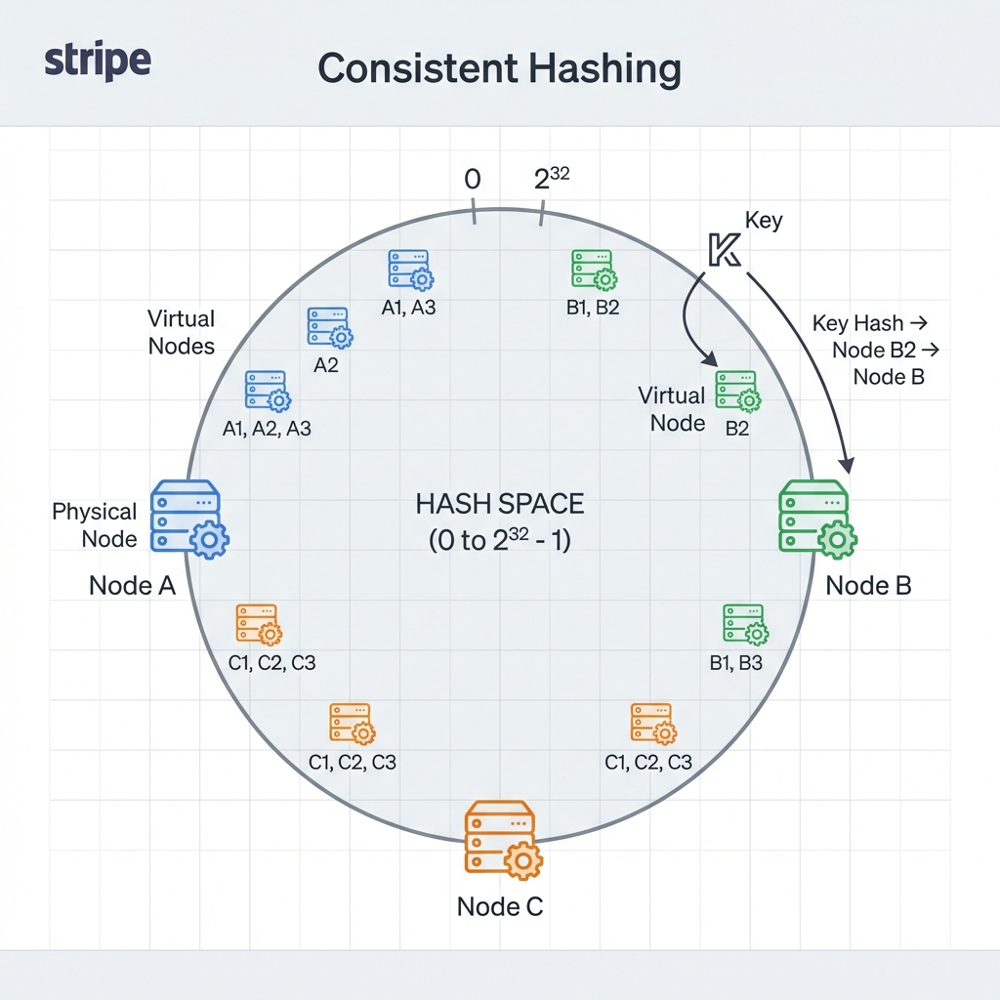

# RingRoute


## Distributed Request Router (Consistent Hashing)

<div align="center">


</div>

**RingRoute** is a specialized Load Balancer designed for **Stateful Distributed Systems**. It implements a **Consistent Hashing Ring** with Virtual Nodes to ensure that requests for specific entities (Users, Sessions, Data Shards) sticky-route to the same worker node, minimizing cache misses during scaling events.

---

## 🚀 Quick Start

Run the full stack (Router + Visualizer):

```bash
# 1. Start High-Performance Engine (Go)
cd backend && go run main.go

# 2. Start Frontend (The Dashboard)
cd frontend && npm run dev
```

> **Setup Guide**: See [GETTING_STARTED.md](./docs/GETTING_STARTED.md).

---

## 📸 Demo & Architecture

### The Hash Ring

*Topology: Users mapped to the nearest Clockwise Node on a 32-bit Ring.*

### Scaling Logic
If a node is added, only `1/N` keys are moved. In traditional Modulo Hashing (`% N`), `N-1/N` keys would move, invalidating nearly all caches.

> **Deep Dive**: See [ARCHITECTURE.md](./docs/ARCHITECTURE.md) for the "Virtual Node" strategy.

---

## ✨ Key Features

*   **🔄 Consistent Hashing**: Minimizes key churn during cluster resizing.
*   **⚖️ Virtual Nodes**: Prevents "Hotspots" by distributing single nodes across multiple ring positions.
*   **📊 Viz Dashboard**: Real-time rendering of the Hash Topology using D3/Canvas.
*   **🏎️ Performance**: `O(log N)` lookup time using Binary Search on the sorted Ring.

---

## 📚 Documentation

| Document | Description |
| :--- | :--- |
| [**System Architecture**](./docs/ARCHITECTURE.md) | High Level Design and Hashing Algorithms. |
| [**Getting Started**](./docs/GETTING_STARTED.md) | API Usage and Dashboard Setup. |
| [**Failure Scenarios**](./docs/FAILURE_SCENARIOS.md) | Handling "Thundering Herd" and Node crashes. |
| [**Interview Q&A**](./docs/INTERVIEW_QA.md) | "Why Virtual Nodes?" and "Hash Collisions". |

---

## 🔧 Tech Stack

| Component | Technology | Role |
| :--- | :--- | :--- |
| **Algorithm** | **Go (Fiber)** | High-Performance Hash Ring Logic. |
| **API** | **Fiber v2** | HTTP Routing (10x faster than Express). |
| **UI** | **Next.js 14** | Topology Visualization. |
| **Hash** | **xxHash32** | Distribution Function. |

---

## 👤 Author

**Harshan Aiyappa**  
Senior Full-Stack Hybrid Engineer  
[GitHub Profile](https://github.com/Kimosabey)

---

## 📝 License

This project is licensed under the MIT License - see the [LICENSE](LICENSE) file for details.
