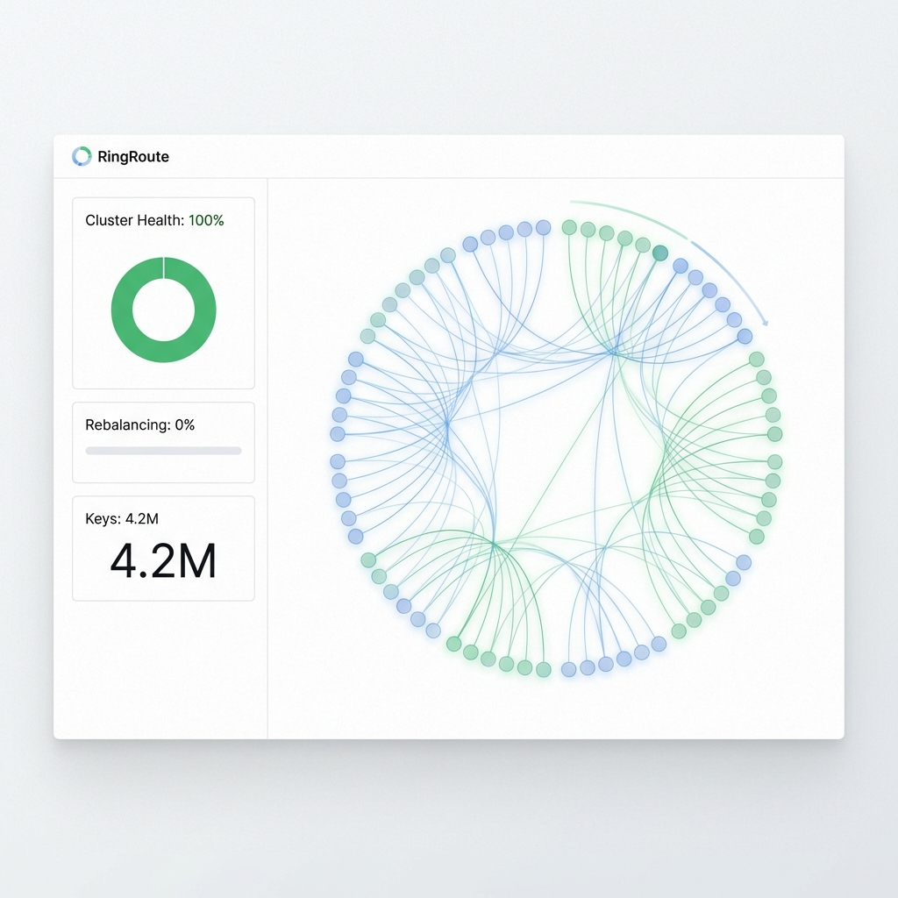
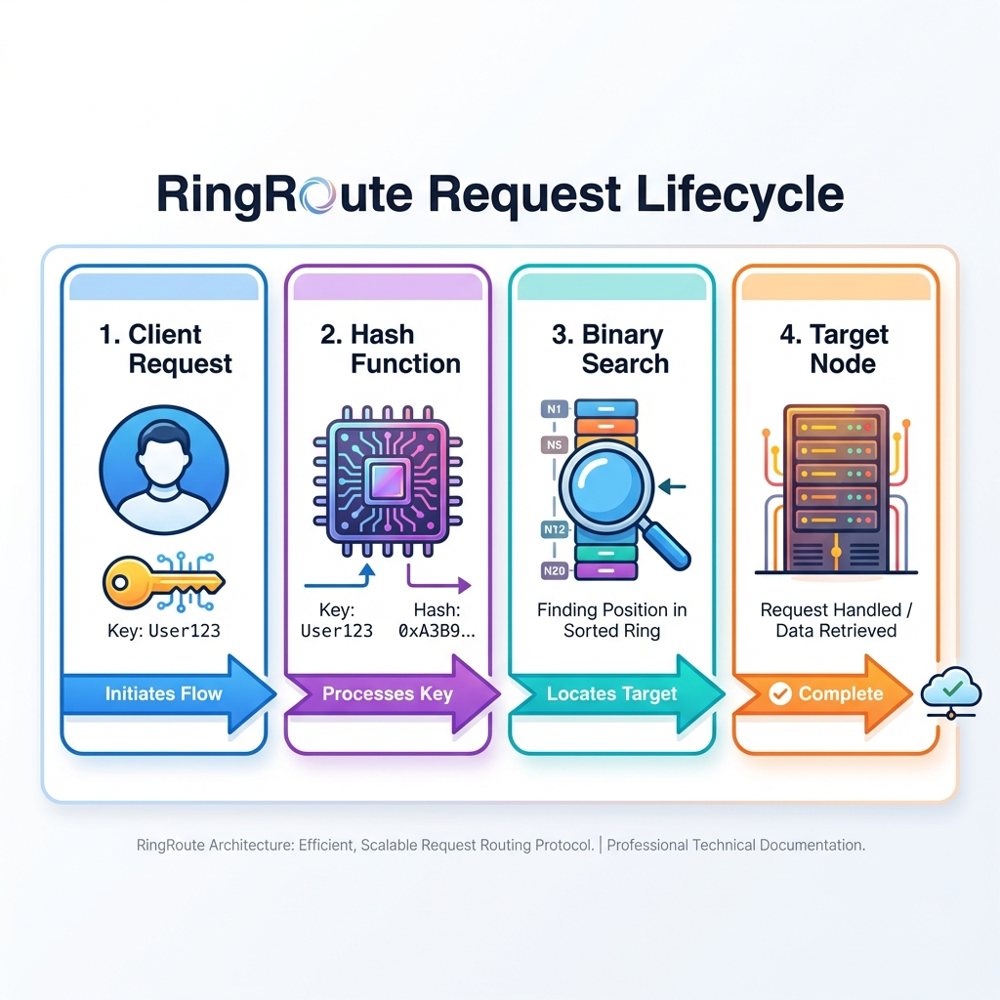

# RingRoute


## Distributed Request Router with Consistent Hashing & Virtual Nodes

<div align="center">


</div>

**RingRoute** is a specialized Load Balancer designed for **Stateful Distributed Systems**. It implements a **Consistent Hashing Ring** with Virtual Nodes to ensure that requests for specific entities (Users, Sessions, Data Shards) sticky-route to the same worker node, minimizing cache misses during scaling events or node failures.

---

## 🚀 Quick Start

Run the full stack (Router + Visualizer) in one command:

```bash
# 1. Start High-Performance Engine (Node.js)
cd backend && npm run dev

# 2. Start Frontend (The Dashboard)
cd frontend && npm run dev
```

> **Detailed Setup**: See [GETTING_STARTED.md](./docs/GETTING_STARTED.md).

---

## 📸 Demo & Architecture

### Real-Time Ring Visualizer

*A high-performance D3.js dashboard rendering the hash ring and real-time key distributions.*

### System Architecture

*Layer 7 Topology: Users mapped to the nearest Clockwise Node on a 32-bit Ring.*

### Scaling Logic (Resilience)

*When a node is added, only `1/N` keys are moved, preventing the "Ring of Death" cascade failure.*

> **Deep Dive**: See [ARCHITECTURE.md](./docs/ARCHITECTURE.md) for the "Virtual Node" strategy.

---

## ✨ Key Features

*   **🔄 Consistent Hashing**: Minimizes key churn to `1/N` during cluster resizing.
*   **⚖️ Virtual Nodes (vNodes)**: Solves the "Skewed Distribution" problem by hashing physical nodes multiple times across the ring.
*   **🏎️ Binary Search Lookup**: Achieves `O(log N)` routing speed by searching the sorted Ring Array.
*   **📊 Viz Dashboard**: Real-time D3.js/Canvas rendering of key ownership.

---

## 🏗️ The Protective Journey

How a request finds its way home in the cluster:

1.  **Request**: Client sends a request with a Partition Key (e.g., `user_id`).
2.  **Hash**: The router hashes the key into the 32-bit Ring Space.
3.  **Search**: Router performs a binary search on physical/virtual nodes to find the first node with `Hash(Node) >= Hash(Key)`.
4.  **Route**: Request is forwarded to the identified Node.
5.  **Failure Protection**: If the node is down, the router automatically "falls clockwise" to the next available neighbor.
6.  **Telemetry**: The visualizer reflects the mapping instantly for observability.

---

## 📚 Documentation

| Document | Description |
| :--- | :--- |
| [**System Architecture**](./docs/ARCHITECTURE.md) | MurmurHash logic, Virtual Node math, and HLD. |
| [**Getting Started**](./docs/GETTING_STARTED.md) | Local installation, Environment, and Benchmarks. |
| [**Failure Scenarios**](./docs/FAILURE_SCENARIOS.md) | Handling "Thundering Herds" and Node Flapping. |
| [**Interview Q&A**](./docs/INTERVIEW_QA.md) | "Modulo vs Consistent Hashing" and "vNode Tuning". |

---

## 🔧 Tech Stack

| Component | Technology | Role |
| :--- | :--- | :--- |
| **Logic** | **Node.js (TS)** | High-Performance Hash Ring Engine. |
| **UI** | **Next.js 14** | Topology Visualization Dashboard. |
| **Viz** | **D3.js / Canvas**| Real-time ring rendering. |
| **Algorithm** | **Consistent Hashing** | Core distribution strategy. |

---

## 👤 Author

**Harshan Aiyappa**  
Senior Full-Stack Hybrid AI Engineer  
Voice AI • Distributed Systems • Infrastructure

[](https://kimo-nexus.vercel.app/)
[](https://github.com/Kimosabey)
[](https://linkedin.com/in/harshan-aiyappa)
[](https://x.com/HarshanAiyappa)

---

## 📝 License

This project is licensed under the MIT License - see the [LICENSE](LICENSE) file for details.
